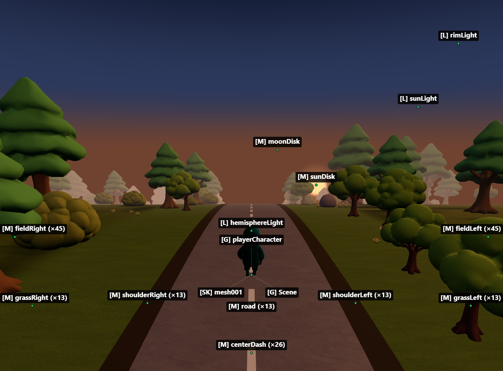
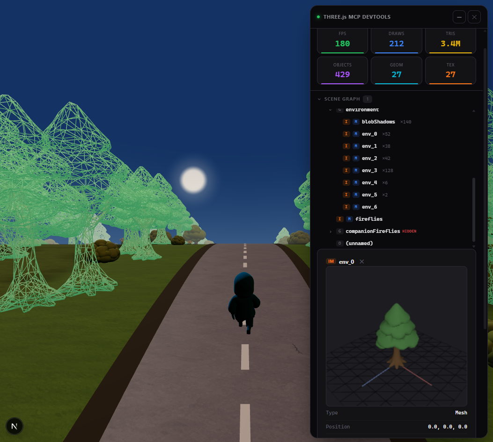

# threejs-devtools-mcp

[](https://www.npmjs.com/package/threejs-devtools-mcp)
[](LICENSE)
[](https://github.com/DmitriyGolub/threejs-devtools-mcp/actions)
[](https://mcp-marketplace.io/server/io-github-dmitriygolub-threejs-devtools)

MCP server for inspecting and modifying Three.js scenes in real time — **59 tools** for objects, materials, shaders, textures, animations, performance monitoring, memory diagnostics, and code generation.

**Zero changes to your project.** Works with vanilla Three.js, React Three Fiber, and any framework.



## Setup

### 1. Add the MCP server

<details open>
<summary><strong>Claude Code</strong></summary>

```bash
claude mcp add threejs-devtools-mcp -- npx threejs-devtools-mcp
```

</details>

<details>
<summary><strong>Claude Desktop</strong></summary>

Add to `claude_desktop_config.json`:

```json
{
  "mcpServers": {
    "threejs-devtools-mcp": {
      "command": "npx",
      "args": ["-y", "threejs-devtools-mcp"]
    }
  }
}
```

</details>

<details>
<summary><strong>Cursor</strong></summary>

Add to `.cursor/mcp.json` in your project:

```json
{
  "mcpServers": {
    "threejs-devtools-mcp": {
      "command": "npx",
      "args": ["-y", "threejs-devtools-mcp"]
    }
  }
}
```

Or use the HTTP transport — see [Cursor setup guide](docs/cursor-setup.md).

</details>

<details>
<summary><strong>Windsurf</strong></summary>

Add to `~/.codeium/windsurf/mcp_config.json`:

```json
{
  "mcpServers": {
    "threejs-devtools-mcp": {
      "command": "npx",
      "args": ["-y", "threejs-devtools-mcp"]
    }
  }
}
```

</details>

<details>
<summary><strong>VS Code (Copilot)</strong></summary>

Add to `.vscode/mcp.json`:

```json
{
  "servers": {
    "threejs-devtools-mcp": {
      "command": "npx",
      "args": ["-y", "threejs-devtools-mcp"]
    }
  }
}
```

</details>

<details>
<summary><strong>OpenCode</strong></summary>

Add to `opencode.json` in your project:

```json
{
  "$schema": "https://opencode.ai/config.json",
  "mcp": {
    "threejs-devtools-mcp": {
      "type": "local",
      "command": ["npx", "-y", "threejs-devtools-mcp"],
      "enabled": true
    }
  }
}
```

</details>

### 2. Start your dev server and open the browser

Start your Three.js dev server as usual (`npm run dev`). The MCP server auto-detects the port from `package.json` and opens a browser at `localhost:9222` with the devtools bridge injected.

> **Keep the browser tab open.** The MCP server talks to your scene through a WebSocket bridge. Close the tab = tools stop working.

### 3. Ask the AI about your scene

```
"show me the scene tree"
"why is my model invisible?"
"make the car red"
"check for memory leaks"
"what's my FPS?"
"generate a React component from character.glb"
```

## In-browser overlay

A built-in devtools panel with live performance stats, interactive scene graph, material editor, and 3D object preview. Activated automatically or via the `toggle_overlay` tool.



## Tip: name your objects

Unnamed objects show as `(unnamed)` in the scene tree. Named objects are easier to find and modify:

```js
// Three.js
mesh.name = "player";
```

```jsx
// React Three Fiber
<mesh name="player" geometry={geometry} material={material} />
```

## Documentation

- [Tools reference](docs/tools.md) — all 59 tools with parameters
- [Advanced setup](docs/advanced.md) — animations, scene export, configuration, transports
- [Cursor setup](docs/cursor-setup.md) — step-by-step guide for Cursor
- [Token-efficient workflow](docs/workflow.md) — best practices for saving context

## License

MIT
